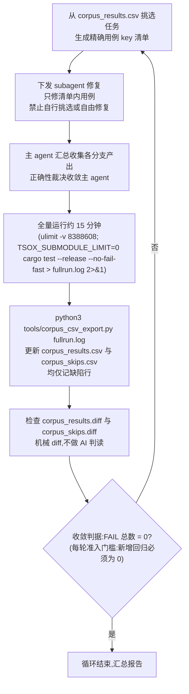

# Agent 基础要求

## 协作规范

- git commit 只在用户明确指示时执行（如「提交一下」）；文档或代码修改后只落盘，不主动提交
- 主分支（main）不频繁小步提交，提交时机与粒度由用户决定
- 合并 subagent 分支一律用 rebase 方式：把分支提交 rebase 到目标分支后 fast-forward（或等价的 rebase-merge），不产生 merge commit

### subagent 语料修复循环（主 agent 编排）

派发粒度：主 agent 先聚簇（按错误码组合/平铺行差异签名），从簇内摘取约 5 个代表性 key 直接写入派发 prompt，并写明预期转绿数作为验收线。禁止把清单文件交给 subagent 自行挑选，也不把全簇 key 一次性全量下发。首批验证通过后滚动派发下一批（可逐步扩大到 10-20 例），不达标打回重修。

派发并发与退出契约：并发 ≤4（宿主 24 核需留 30% 余量；subagent 构建 `CARGO_BUILD_JOBS=3`、批量 `TSOX_SUBMODULE_JOBS=4`）。派发 prompt 必须内联（模板 `tools/subagent_prompt_template.md`，不引用路径代替全文）：总时长预算（默认 75 分钟，剩 15 分钟强制收尾）、单根因 25 分钟熔断、每根因验证通过立即 commit（禁止只在末端提交一次）、Bash 连续 3 次故障即写交接退出、验收线达成即报告退出。subagent 禁止全量测试与运行 `tools/corpus_csv_export.py`，禁改仓库根 CSV/AGENTS.md/tools/；全量与双表导出只由主 agent 在收集后执行。

收敛指标：以 `corpus_results.csv` 的 FAIL 总数为准。FAIL = 0 即收敛、循环结束。每轮准入门槛：新增回归必须为 0 且 FAIL 数下降，否则该轮作废重修。SKIP 必须与 Go 保持一致：SKIP 集合超出 Go 的部分按缺陷对待，纳入修复循环，不计入合法收敛状态。

SKIP 差异表：`python3 tools/corpus_csv_export.py` 每轮同时产出 `corpus_skips.csv`（超出 Go 合法 SKIP 基准的用例，基准记录在 `tools/skip_baseline.txt`，缺失时全部 SKIP 视为差异）。SKIP 差异与 FAIL 同流程修复：挑选 key 下发 subagent、循环消解，直至 `corpus_skips.csv` 为空。

函数靠齐追踪表：`python3 tools/gen_func_alignment.py` 生成仓库根 `func_alignment.csv`（静态抓取 Go/Rust 两侧全部函数名，camelCase↔snake_case 由脚本归一为 `norm_name` 排序键，单表左右对照：已匹配的两侧同行展示，未匹配按 go_only/rust_only 标注且同名/近名行相邻；match_type 按 exact/suffix_variant/fuzzy/go_only/rust_only 分级）。每次修复中某个 Go 函数被靠齐后，主 agent 在收集裁决时执行 `--mark --go <函数名> --status yes|partial|no --round <轮次> --note <备注>` 标记该行；重新生成保留已有标记。该表与仓库根 CSV 同为 subagent 只读，用于快速掌握哪些 Go 函数已靠齐、哪些尚无对应。

## 代码规范

### 代码拒绝注释

代码自身的命名和结构应当足以表达意图。

**禁止**：
- 解释"这段代码做了什么"的注释，应通过提取有意义的函数名/变量名来表达
- 解释"为什么"这样做的注释，应写到外部文档（`docs/` 下的设计文档、issue、commit message），不要留在代码里
- 逐行翻译式注释

**要求**:
- 注释掉的死代码，直接删除
- 引用外部规范/issue/RFC 的标记（如 `// RFC 1234`），放到外部文档
- 模块/文件顶部的 `//!` 职责说明，模块职责应从命名和文件夹结构推测
- 公开 API 的 doc comment（`///`），除非是供外部调用的框架/库（crate 发布到 crates.io 或被 workspace 外引用），否则不加

### 单文件不超过 300 行

任何 `.rs` 源文件（不含测试文件）超过 300 行时，必须拆分为子模块。

拆分原则：
- 按职责拆分到 `mod.rs` 子目录，而非机械地按函数切分
- 公开 API 在 `lib.rs` / `mod.rs` 统一 re-export（`pub use`），保持对外接口不变
- 测试文件（`tests/` 下的集成测试）不受此限制

## 测试规范

任何测试都不与源码文件混放。不采用内联测试（`#[cfg(test)] mod tests`）。

- **所有测试**：放在 crate 根的 `tests/` 目录下（独立文件），只测公开 API
- 需要测私有逻辑时，通过 `#[doc(hidden)] pub` 或将待测逻辑提取为独立模块/crate 暴露出来，而非内联测试访问私有成员
- **不要**把集成测试写在 `examples/` 目录里冒充测试，examples 是可运行的示例程序，不是 `cargo test` 的一部分

**`tests/` 根下的每个 `.rs` 都是一个独立 binary（独立链接目标），只放少量真正的独立测试入口。**

批量生成型测试（语料用例、fourslash 等成百上千条同框架用例）必须收敛为单一集成测试目标：

- 形态：`tests/<套件名>/main.rs` 作为该套件唯一入口（`tests/` 子目录不会自动成为 binary），用例文件放在入口的子目录里，入口统一 `mod`/`include!` 声明
- 用例与模块清单由生成器一并产出并维护，手工不逐个增删
- 禁止在 `tests/` 根下平铺生成大量单用例 `.rs` 文件

测试分层：
- 纯逻辑（序列化、解析、状态转换）→ `tests/` 下的单元测试文件
- 跨模块/进程内集成（HTTP 路由、WS 信令、WebRTC 建立）→ `tests/` 集成测试
- 批量语料/生成型用例 → `tests/<套件名>/` 单一目标（见上）
- 多进程编排（需要启动外部服务，无浏览器）→ CI 中的集成 job
- 浏览器 UI 端到端 → 独立的 Playwright 工程

### 测试运行规范

- Rust 全量/批量测试：`(ulimit -v 8388608; cargo test --release --no-fail-fast)`，内存限制必须保留（RLIMIT_AS 8GB，防止 OOM 波及宿主其他进程）；release 相对 debug 有 5 倍执行提速（fourslash 4471 用例单二进制约 60s，构建成本远小于收益）
- Rust 单条用例调试迭代：debug 构建可接受（编译快，单条秒级），同样保留内存限制
- Go oracle：`GOMEMLIMIT=4GiB go test -count=1 ./...`（Go 运行时对 RLIMIT_AS 敏感，用软限）
- 全量语料的内存护栏脚本 `tools/fourslash_shard.py`（分片 + 单线程 + RSS 采样 + 断点续跑），批量回归异常排查时启用

超限的表现是进程被提前杀死或输出不完整；此时按内存/死循环根因排查（受控探针测斜率、变体二分）。

- 批量/全量测试运行后，执行 `python3 tools/corpus_csv_export.py fullrun.log` 更新仓库根 `corpus_results.csv`：只记 FAIL 用例，表头 `key,seconds`，key 为 `compiler/<用例名>`，按 key 字典序；脚本自动将上一轮存为 `corpus_results.prev.csv` 并生成 `corpus_results.diff`

## 文档规范

仓库文档按位置分层，各自回答一类问题，**做什么、怎么做、为什么不做**：

| 位置 | 类型 | 内容 |
|---|---|---|
| 仓库根 `README.md` | 导航 | 项目职责、功能模块、开发命令、目录结构、指向 `docs/` 的链接 |
| 仓库根 `roadmap/` | 做什么 | 规划中的方向、待办、设计构想（未来时态） |
| 仓库根 `todos/` | 做什么（待办粒度） | 代办事项文档：具体的、可跟进的待办项；方向性规划仍在 `roadmap/` |
| 仓库根 `docs/` | 怎么做 | 设计文档、架构说明、协议约定：机制、流程与权衡论证 |
| 仓库根 `decisions/` | 为什么不做（含为什么这样做） | 已拍板决策记录（ADR）：结论 + 理由；**否决项必须在此留档且细节自包含**（不写「详见 docs」）；引用方向为 `docs/` → `decisions/`，反向不成立 |
| 仓库根 `issues/` | 已知问题 | 设计债、open questions（不含未来规划，不含已拍板决策） |

「不做」是一等决策：拒绝一个方案与采纳一个方案同等留档，没有记录的「不做」会被反复重新提议、反复重新论证。

文档不是 API 参考，具体实现细节由代码承担。

文档的内容与拆分按 [Divio 文档体系](https://docs.divio.com/documentation-system/) 处理，每份文档明确自己属于哪个象限，不混杂：

| 象限 | 回答的问题 | 特征 | 归属 |
|---|---|---|---|
| 教程（tutorials） | "带我走一遍" | 面向学习，可照做的完整过程，保证结果 | QuickStart、入门示例 |
| 操作指南（how-to） | "怎么完成某件事" | 面向目标，假设已有基础，步骤化 | 部署指南、配置说明 |
| 参考（reference） | "它是什么/有哪些" | 面向查阅，准确、完整、结构化，无叙事 | API 表、协议/消息格式、配置项 |
| 解释（explanation） | "为什么是这样" | 面向理解，讲设计动机、权衡、替代方案 | 设计文档、架构总览、决策记录 |

拆分原则：

- 一份文档一个象限；"设计 + 操作步骤"混在一起时拆成两份互链；
- 表结构等数据定义单独成参考档（`*-schema.md`），设计档只讲机制与流程，不放 schema 定义；
- 单份文档不超过 150 行：超长时**优先分离 mermaid 图表**到同名 `.diagram.md` 文件（与正文同目录，正文原位留一行指针），仍超长再按象限拆分；
- 变更记录不入正文：每份文档的变更单独记在同名 `.change.md` 后缀文件（`foo.md` → `foo.change.md`，与正文同目录），按同名约定发现，正文不留指针。

写作规范：

- 安全类内容先写后果，会造成什么危害，再写机制与方案；
- 未经人工协商的推测内容不入档，宁可留〔待补〕占位，不写推测性草案；
- 流程描述一律用 mermaid 图（flowchart / sequenceDiagram），不用纯文本箭头或字符画；
- 不用破折号等书面转折符号，用逗号、冒号或拆句表达；
- 跨文档引用精确到小节：目标小节标题上方加 `` 锚点，引用写作 `文档.md#短名`，不用 § 编号裸文本；
- 文档头部只保留一行版本号（`> 版本：vX.Y · 日期`，须与同名 `.change.md` 最新版本一致）；象限、关联、背景等说明不入头部，象限归属见 `docs/README.md` 导航，变更背景记入 `.change.md`，必要的前置说明写入正文。
