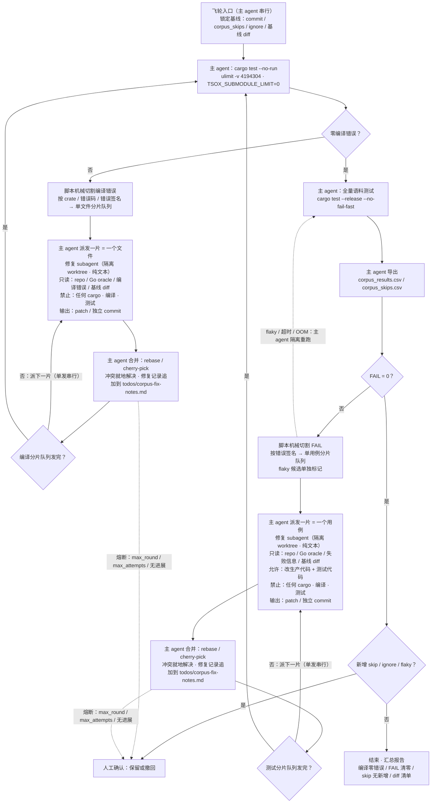

# Agent 基础要求

## 协作规范

- git commit 只在用户明确指示时执行（如「提交一下」）；文档或代码修改后只落盘，不主动提交
- 主分支（main）不频繁小步提交，提交时机与粒度由用户决定
- 合并 subagent 分支一律用 rebase 方式：把分支提交 rebase 到目标分支后 fast-forward（或等价的 rebase-merge），不产生 merge commit

### 语料修复飞轮

主 agent 是唯一构建者与测试者；subagent 全程**纯文本**（在隔离 worktree 内操作，禁构建、禁跑测试，输出 patch / 独立 commit），由主 agent 按分发顺序统一合并。

```mermaid
flowchart TD
    START["飞轮入口（主 agent 串行）<br/>锁定基线：commit / corpus_skips / ignore / 基线 diff"]
    START --> NR["主 agent：cargo test --no-run<br/>ulimit -v 4194304 · TSOX_SUBMODULE_LIMIT=0"]
    NR --> NRQ{"零编译错误？"}
    NRQ -->|否| CUT_C["脚本机械切割编译错误<br/>按 crate / 错误码 / 错误签名 → 单文件分片队列"]
    CUT_C --> DISP_C["主 agent 派发一片 = 一个文件<br/>修复 subagent（隔离 worktree · 纯文本）<br/>只读：repo / Go oracle / 编译错误 / 基线 diff<br/>禁止：任何 cargo · 编译 · 测试<br/>输出：patch / 独立 commit"]
    DISP_C --> MERGE_C["主 agent 合并：rebase / cherry-pick<br/>冲突就地解决 · 修复记录追加到 todos/corpus-fix-notes.md"]
    MERGE_C --> WAIT_C{"编译分片队列发完？"}
    WAIT_C -->|否：派下一片（单发串行）| DISP_C
    WAIT_C -->|是| NR
    NRQ -->|是| RUN["主 agent：全量语料测试<br/>cargo test --release --no-fail-fast"]
    RUN --> EXP["主 agent 导出<br/>corpus_results.csv / corpus_skips.csv"]
    EXP --> TQ{"FAIL = 0？"}
    TQ -->|否| CUT_T["脚本机械切割 FAIL<br/>按错误签名 → 单用例分片队列<br/>flaky 候选单独标记"]
    CUT_T --> DISP_T["主 agent 派发一片 = 一个用例<br/>修复 subagent（隔离 worktree · 纯文本）<br/>只读：repo / Go oracle / 失败信息 / 基线 diff<br/>允许：改生产代码 + 测试代码<br/>禁止：任何 cargo · 编译 · 测试<br/>输出：patch / 独立 commit"]
    DISP_T --> MERGE_T["主 agent 合并：rebase / cherry-pick<br/>冲突就地解决 · 修复记录追加到 todos/corpus-fix-notes.md"]
    MERGE_T --> WAIT_T{"测试分片队列发完？"}
    WAIT_T -->|否：派下一片（单发串行）| DISP_T
    WAIT_T -->|是| NR
    TQ -->|是| CHK{"新增 skip / ignore / flaky？"}
    CHK -->|否| END["结束 · 汇总报告<br/>编译零错误 / FAIL 清零 / skip 无新增 / diff 清单"]
    CHK -->|是| HUMAN["人工确认：保留或撤回"]
    CUT_T -.->|"flaky / 超时 / OOM：主 agent 隔离重跑"| RUN
    MERGE_C -.->|"熔断：max_round / max_attempts / 无进展"| HUMAN
    MERGE_T -.->|"熔断：max_round / max_attempts / 无进展"| HUMAN
```

- **基线锁定（入口）**：主 agent 串行记录当前 commit、corpus_skips 状态、ignore 清单、基线 diff，作为本轮飞轮的对照基线。
- **编译闸门**：`cargo test --no-run`（ulimit -v 4194304，TSOX_SUBMODULE_LIMIT=0）。有编译错误则脚本机械切割（按 crate / 错误码 / 错误签名），进入编译分片循环；零错误才放行测试闸门。
- **测试闸门**：`cargo test --release --no-fail-fast` 全量语料 → `corpus_csv_export.py` 出双表。FAIL > 0 则脚本机械切割（按错误签名 / 用例簇，flaky 候选单独标记），进入测试分片循环；测试修复合并后**必须回到编译闸门**（改动可能引入编译错）。
- **分发（两轮同规，单发串行 · 2026-09-29 用户拍板）**：脚本仍机械切割出全量分片队列，但主 agent **一次只派发一片**：编译轮一个文件、测试轮一个用例，in-flight 恒为 1；**不做多族 / 多分片并发分发**（旧「并发 8-12 · 名额一空立即补发」口径废止）。每片修复返回即合并，并把该次修复记录（文件/用例、根因、对照的 Go 源、改动点、结果与 CSV 变化）追加到仓库级笔记 `todos/corpus-fix-notes.md`（最新在上；系统记忆已清空，仓库内文件是唯一留存），然后才派发下一片；队列发完回对应闸门做一次复验。
- **subagent 契约（纯文本）**：隔离 worktree；只读 repo / Go oracle（`/home/cqh/workspace/typescript-go`）/ 派发 prompt 内联的错误清单与基线 diff；禁止任何 cargo 命令、编译、测试；测试分片允许改生产代码 + 测试代码；按根因增量独立 commit；汇报**函数变更表**（缺表打回）。30 分钟预算（剩 6 分钟强制收尾）、单根因 10 分钟熔断、Bash 连续 3 次故障写交接退出。**禁止用空壳实现消错**：恒返 `None`/空函数体/`let _ =` 丢弃结果/捏造常量值/删真实逻辑换占位，均属编造行为迁就编译——符号不存在时只允许三选一：grep 到真实等价符号改接线、按 Go 移植最小真实实现、保留错误记交接留给下一轮。主 agent 收集时抽查 diff，发现 None 化/空壳模式整轮回滚重派。
- **合并**：主 agent 每片返回即 rebase / cherry-pick 回主仓，冲突按 Go 语义就地解决；全部片发完后回对应闸门做一次复验（不逐片复验）。
- **异常路由**：flaky / 超时 / OOM 由主 agent 隔离重跑判定，不入分片；熔断条件（max_round / max_attempts / 无进展）触发即停轮交人工；轮末新增 skip / ignore / flaky 必须人工确认保留或撤回，未经批注不得视为收敛。
- **收敛**：编译零错误 + FAIL = 0 + skip 无新增 + diff 清单，四项齐备飞轮结束。

函数靠齐追踪表：`python3 tools/gen_func_alignment.py` 生成仓库根 `func_alignment.csv`（静态抓取 Go/Rust 两侧全部函数名，camelCase↔snake_case 由脚本归一为 `norm_name` 排序键，单表左右对照：已匹配的两侧同行展示，未匹配按 go_only/rust_only 标注且同名/近名行相邻；match_type 按 exact/suffix_variant/fuzzy/go_only/rust_only 分级）。每次修复中某个 Go 函数被靠齐后，主 agent 在收集裁决时执行 `--mark --go <函数名> --status yes|partial|no --round <轮次> --note <备注>` 标记该行；重新生成保留已有标记。该表与仓库根 CSV 同为 subagent 只读，用于快速掌握哪些 Go 函数已靠齐、哪些尚无对应。

**靠齐判定纪律（不可违反）**：我们在做的是**按名称匹配迁移，只以 `func_alignment.csv` 表格数据为准**。不得随意以其他方式（报告声称、语义判断、探针观察等）认为匹配完成。

## 代码规范

### 代码拒绝注释

代码自身的命名和结构应当足以表达意图。

**禁止**：
- 解释"这段代码做了什么"的注释，应通过提取有意义的函数名/变量名来表达
- 解释"为什么"这样做的注释，应写到外部文档（`docs/` 下的设计文档、issue、commit message），不要留在代码里
- 逐行翻译式注释

**要求**:
- 注释掉的死代码，直接删除
- 引用外部规范/issue/RFC 的标记（如 `// RFC 1234`），放到外部文档
- 模块/文件顶部的 `//!` 职责说明，模块职责应从命名和文件夹结构推测
- 公开 API 的 doc comment（`///`），除非是供外部调用的框架/库（crate 发布到 crates.io 或被 workspace 外引用），否则不加

### 单文件不超过 300 行

任何 `.rs` 源文件（不含测试文件）超过 300 行时，必须拆分为子模块。

拆分原则：
- 按职责拆分到 `mod.rs` 子目录，而非机械地按函数切分
- 公开 API 在 `lib.rs` / `mod.rs` 统一 re-export（`pub use`），保持对外接口不变
- 测试文件（`tests/` 下的集成测试）不受此限制

## 测试规范

任何测试都不与源码文件混放。不采用内联测试（`#[cfg(test)] mod tests`）。

- **所有测试**：放在 crate 根的 `tests/` 目录下（独立文件），只测公开 API
- 需要测私有逻辑时，通过 `#[doc(hidden)] pub` 或将待测逻辑提取为独立模块/crate 暴露出来，而非内联测试访问私有成员
- **不要**把集成测试写在 `examples/` 目录里冒充测试，examples 是可运行的示例程序，不是 `cargo test` 的一部分

**`tests/` 根下的每个 `.rs` 都是一个独立 binary（独立链接目标），只放少量真正的独立测试入口。**

批量生成型测试（语料用例、fourslash 等成百上千条同框架用例）必须收敛为单一集成测试目标：

- 形态：`tests/<套件名>/main.rs` 作为该套件唯一入口（`tests/` 子目录不会自动成为 binary），用例文件放在入口的子目录里，入口统一 `mod`/`include!` 声明
- 用例与模块清单由生成器一并产出并维护，手工不逐个增删
- 禁止在 `tests/` 根下平铺生成大量单用例 `.rs` 文件

测试分层：
- 纯逻辑（序列化、解析、状态转换）→ `tests/` 下的单元测试文件
- 跨模块/进程内集成（HTTP 路由、WS 信令、WebRTC 建立）→ `tests/` 集成测试
- 批量语料/生成型用例 → `tests/<套件名>/` 单一目标（见上）
- 多进程编排（需要启动外部服务，无浏览器）→ CI 中的集成 job
- 浏览器 UI 端到端 → 独立的 Playwright 工程

### 测试运行规范

- Rust 全量/批量测试：`(ulimit -v 4194304; cargo test --release --no-fail-fast)`，内存限制必须保留（RLIMIT_AS 4GB——2026-09-29 用户指示由 8GB 降档：语料 worker 每用例独立进程实际峰值远低于此，fourslash OOM 的瓶颈是套件累计驻留而非单限值，降档防宿主内存压力）；release 相对 debug 有 5 倍执行提速（fourslash 4471 用例单二进制约 60s，构建成本远小于收益）
- Rust 单条用例调试迭代：debug 构建可接受（编译快，单条秒级），同样保留内存限制
- Go oracle：`GOMEMLIMIT=4GiB go test -count=1 ./...`（Go 运行时对 RLIMIT_AS 敏感，用软限）
- 全量语料的内存护栏脚本 `tools/fourslash_shard.py`（分片 + 单线程 + RSS 采样 + 断点续跑），批量回归异常排查时启用

超限的表现是进程被提前杀死或输出不完整；此时按内存/死循环根因排查（受控探针测斜率、变体二分）。

- 批量/全量测试运行后，执行 `python3 tools/corpus_csv_export.py fullrun.log` 更新仓库根 `corpus_results.csv`：只记 FAIL 用例，表头 `key,seconds`，key 为 `compiler/<用例名>`，按 key 字典序；脚本自动将上一轮存为 `corpus_results.prev.csv` 并生成 `corpus_results.diff`

## 文档规范

仓库文档按位置分层，各自回答一类问题，**做什么、怎么做、为什么不做**：

| 位置 | 类型 | 内容 |
|---|---|---|
| 仓库根 `README.md` | 导航 | 项目职责、功能模块、开发命令、目录结构、指向 `docs/` 的链接 |
| 仓库根 `roadmap/` | 做什么 | 规划中的方向、待办、设计构想（未来时态） |
| 仓库根 `todos/` | 做什么（待办粒度） | 代办事项文档：具体的、可跟进的待办项；方向性规划仍在 `roadmap/` |
| 仓库根 `docs/` | 怎么做 | 设计文档、架构说明、协议约定：机制、流程与权衡论证 |
| 仓库根 `decisions/` | 为什么不做（含为什么这样做） | 已拍板决策记录（ADR）：结论 + 理由；**否决项必须在此留档且细节自包含**（不写「详见 docs」）；引用方向为 `docs/` → `decisions/`，反向不成立 |
| 仓库根 `issues/` | 已知问题 | 设计债、open questions（不含未来规划，不含已拍板决策） |

「不做」是一等决策：拒绝一个方案与采纳一个方案同等留档，没有记录的「不做」会被反复重新提议、反复重新论证。

文档不是 API 参考，具体实现细节由代码承担。

文档的内容与拆分按 [Divio 文档体系](https://docs.divio.com/documentation-system/) 处理，每份文档明确自己属于哪个象限，不混杂：

| 象限 | 回答的问题 | 特征 | 归属 |
|---|---|---|---|
| 教程（tutorials） | "带我走一遍" | 面向学习，可照做的完整过程，保证结果 | QuickStart、入门示例 |
| 操作指南（how-to） | "怎么完成某件事" | 面向目标，假设已有基础，步骤化 | 部署指南、配置说明 |
| 参考（reference） | "它是什么/有哪些" | 面向查阅，准确、完整、结构化，无叙事 | API 表、协议/消息格式、配置项 |
| 解释（explanation） | "为什么是这样" | 面向理解，讲设计动机、权衡、替代方案 | 设计文档、架构总览、决策记录 |

拆分原则：

- 一份文档一个象限；"设计 + 操作步骤"混在一起时拆成两份互链；
- 表结构等数据定义单独成参考档（`*-schema.md`），设计档只讲机制与流程，不放 schema 定义；
- 单份文档不超过 150 行：超长时**优先分离 mermaid 图表**到同名 `.diagram.md` 文件（与正文同目录，正文原位留一行指针），仍超长再按象限拆分；
- 变更记录不入正文：每份文档的变更单独记在同名 `.change.md` 后缀文件（`foo.md` → `foo.change.md`，与正文同目录），按同名约定发现，正文不留指针。

写作规范：

- 安全类内容先写后果，会造成什么危害，再写机制与方案；
- 未经人工协商的推测内容不入档，宁可留〔待补〕占位，不写推测性草案；
- 流程描述一律用 mermaid 图（flowchart / sequenceDiagram），不用纯文本箭头或字符画；
- 不用破折号等书面转折符号，用逗号、冒号或拆句表达；
- 跨文档引用精确到小节：目标小节标题上方加 `` 锚点，引用写作 `文档.md#短名`，不用 § 编号裸文本；
- 文档头部只保留一行版本号（`> 版本：vX.Y · 日期`，须与同名 `.change.md` 最新版本一致）；象限、关联、背景等说明不入头部，象限归属见 `docs/README.md` 导航，变更背景记入 `.change.md`，必要的前置说明写入正文。
