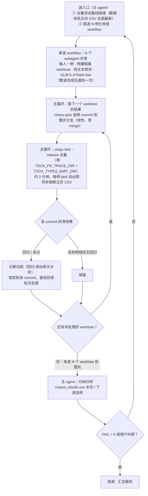

# Agent 基础要求

## 协作规范

- git commit 只在用户明确指示时执行（如「提交一下」）；文档或代码修改后只落盘，不主动提交
- 主分支（main）不频繁小步提交，提交时机与粒度由用户决定
- **产出整合纪律**：workflow/subagent 修复完成后，整合一律新建干净分支 + 逐 commit cherry-pick（或等价 rebase 线性化），禁止 merge commit——merge 历史混乱、无法人工识别每个改动的来源与顺序。主仓合入同口径：分支上的修复 commit 保持线性可追溯。

### 语料修复飞轮

主 agent 是唯一构建者、测试者与循环驱动者；subagent 全程**纯文本**（隔离 worktree 内只修**一个用例**，禁构建禁测试，输出独立 commit）。

**修复模型**：GLM-5.3-Flash · low 思考档。

**架构约束**：一个 workflow 只做**单波并发修复**——N 个并发位 = N 个用例，每个 subagent 只修一个用例，不做组内串行循环；跨多波的目标用例总数由主 agent 分波达成，不在 workflow 内循环。

```mermaid
flowchart TD
    START["波入口（主 agent）<br/>① 全量测试基线就绪（数据体系五份 CSV 全部最新）<br/>② 挑选 N 例分发给 workflow"]
    START --> WF["单波 workflow：N 个 subagent 并发<br/>每人一例 · 预建隔离 worktree · 纯文本禁测 · GLM-5.3-Flash low<br/>（整波完成后通知一次）"]
    WF --> PICK["主循环：取下一个 worktree 的结果<br/>cherry-pick 该例 commit 到整合分支（线性，禁 merge）"]
    PICK --> FULL["主循环：cargo test --release 全量<br/>（带 TSOX_FN_TRACE_DIR + TSOX_TYPES_EMIT_DIR）<br/>约 2 分钟，每例 pick 后必跑<br/>同步刷新五份 CSV"]
    FULL --> VERDICT{"该 commit 的净效果"}
    VERDICT -->|"目标例绿且无回归"| NEXT["保留"]
    VERDICT -->|"回归 / 未过"| HANDLE["记录归因（回归-改动相关分析）<br/>锁定到该 commit，留给后续轮次处理"]
    HANDLE --> MORE{"还有未处理的 worktree？"}
    NEXT --> MORE
    MORE -->|是| PICK
    MORE -->|"否：本波 N 个 worktree 处理完"| ANALYSIS["主 agent：归纳分析<br/>corpus_results.csv 水位 / 下波选例"]
    ANALYSIS --> DECIDE{"FAIL = 0 或用户叫停？"}
    DECIDE -->|否| START
    DECIDE -->|是| END["结束 · 汇总报告"]
```

- **选例**：从 `corpus_results.csv` 挑选 N 例（排除在飞/留队用例，同族错开或取代表例）启动单波 workflow。
- **数据体系（仓库根 CSV，全量后同步刷新）**：
  - `corpus_results.csv` / `corpus_skips.csv`——FAIL 全量 / SKIP 全量（水位与选例出发点）；
  - `corpus_rust_trace.csv`——Rust 侧 FAIL 对齐函数调用序列（trace 中间产物在 `.traces/`，gitignore，每次全量重刷后由脚本汇总为本 CSV）；
  - `corpus_go_trace.csv`——Go 侧函数调用序列（一次性数据，oracle 源码不变不重采）；
  - `corpus_rust_types.csv`——Rust 侧**全量** .types 输出（6284 例，`tools/types_csv.py rust` 从 `.traces/types/` 汇总；每次全量后刷新）；
  - `corpus_go_types.csv`——Go 侧全量 .types reference（6512 例，`tools/types_csv.py go` 一次性产出，oracle 不变不重采）；
  - `corpus_types_anchor.csv`——每例 .types **首分歧锚点**（本地 vs Go reference 的第一个类型分歧行+两侧上下文），由 `tools/types_anchor.py` 从两侧 types CSV 提取，与 trace 同级；
  - `corpus_stack_diff.csv`——两侧执行栈差集（go_only / rust_only），由 `tools/stack_diff.py` 产出。
  分片 `/tmp/flywheel_shards/` 汇总以上数据供 subagent 直接读取。
- **逐例整合与验证（N 次，波末执行）**：workflow 整波完成通知后，主 agent 逐个 worktree 处理其结果——cherry-pick 该 worktree 分支上的 commit 到整合分支 → 全量（带 `TSOX_FN_TRACE_DIR` + `TSOX_TYPES_EMIT_DIR`，约 2 分钟）→ 判定，循环 N 次。**每次全量同步刷新全部 CSV**（上述数据体系全部五份）——回归发生时归因数据（trace 差集变化、.types 锚点位移）与水位数据同刻更新，可直接用于处置与下一波选例。全量已降至 2 分钟，逐例验证成本可承受，收益是**回归精确归因到单个 commit**（N 个改动不混批）；编译失败同样逐例暴露（机械错可最小修复并标注，逻辑错原样记录）。
- **回归处置**：某 commit 引入回归时**只记录归因、当场不修**——按「回归-改动相关分析」锁定到该 commit（真回归 vs 假绿暴露、波及例清单），该 commit 可保留或回退由归因结论决定；修复动作留给后续轮次（回归例进下一波选例或专项分片）。
- **subagent 契约（单例分片）**：隔离 worktree；只读 repo / Go oracle（`/home/cqh/workspace/typescript-go`）/ 分片失败信息（三层锚点：.types 首分歧 → 错误 diff → 执行栈对照，见 `/tmp/flywheel_shards/` 与仓库根 trace CSV）；禁止任何 cargo/编译/测试/探针；禁止 skip/改断言/改基线消错与空壳实现；符号不存在三选一（grep 等价接线 / 按 Go 最小真实实现 / 保留错误记交接）；按根因独立 commit（只 add crates/ 生产路径）；汇报 rootCause（双侧源码行号）与**函数变更表**（缺表打回）。时限为期望值（目标 30 分钟级，非硬截点），单根因约 10 分钟无进展换思路或收尾交接。
- **异常路由**：深水例（两轮不收敛）入留队池待人工或主 agent 插桩通道；「错错相抵」型回红（前置修复互斥）一律新建 worktree 重审而非续修；新增 skip / 基线变更必须人工确认。
- **收敛**：FAIL = 0 + 回归归零 + 汇总报告。

函数靠齐追踪表：`python3 tools/gen_func_alignment.py` 生成仓库根 `func_alignment.csv`（静态抓取 Go/Rust 两侧全部函数名，camelCase↔snake_case 由脚本归一为 `norm_name` 排序键，单表左右对照）。该表与仓库根 CSV 同为 subagent 只读。

**靠齐判定纪律（不可违反）**：我们在做的是**按名称匹配迁移，只以 `func_alignment.csv` 表格数据为准**。不得随意以其他方式（报告声称、语义判断、探针观察等）认为匹配完成。

## 代码规范

### 代码拒绝注释

代码自身的命名和结构应当足以表达意图。

**禁止**：
- 解释"这段代码做了什么"的注释，应通过提取有意义的函数名/变量名来表达
- 解释"为什么"这样做的注释，应写到外部文档（`docs/` 下的设计文档、issue、commit message），不要留在代码里
- 逐行翻译式注释

**要求**:
- 注释掉的死代码，直接删除
- 引用外部规范/issue/RFC 的标记（如 `// RFC 1234`），放到外部文档
- 模块/文件顶部的 `//!` 职责说明，模块职责应从命名和文件夹结构推测
- 公开 API 的 doc comment（`///`），除非是供外部调用的框架/库（crate 发布到 crates.io 或被 workspace 外引用），否则不加

### 单文件不超过 300 行

任何 `.rs` 源文件（不含测试文件）超过 300 行时，必须拆分为子模块。

拆分原则：
- 按职责拆分到 `mod.rs` 子目录，而非机械地按函数切分
- 公开 API 在 `lib.rs` / `mod.rs` 统一 re-export（`pub use`），保持对外接口不变
- 测试文件（`tests/` 下的集成测试）不受此限制

## 测试规范

任何测试都不与源码文件混放。不采用内联测试（`#[cfg(test)] mod tests`）。

- **所有测试**：放在 crate 根的 `tests/` 目录下（独立文件），只测公开 API
- 需要测私有逻辑时，通过 `#[doc(hidden)] pub` 或将待测逻辑提取为独立模块/crate 暴露出来，而非内联测试访问私有成员
- **不要**把集成测试写在 `examples/` 目录里冒充测试，examples 是可运行的示例程序，不是 `cargo test` 的一部分

**`tests/` 根下的每个 `.rs` 都是一个独立 binary（独立链接目标），只放少量真正的独立测试入口。**

批量生成型测试（语料用例、fourslash 等成百上千条同框架用例）必须收敛为单一集成测试目标：

- 形态：`tests/<套件名>/main.rs` 作为该套件唯一入口（`tests/` 子目录不会自动成为 binary），用例文件放在入口的子目录里，入口统一 `mod`/`include!` 声明
- 用例与模块清单由生成器一并产出并维护，手工不逐个增删
- 禁止在 `tests/` 根下平铺生成大量单用例 `.rs` 文件

测试分层：
- 纯逻辑（序列化、解析、状态转换）→ `tests/` 下的单元测试文件
- 跨模块/进程内集成（HTTP 路由、WS 信令、WebRTC 建立）→ `tests/` 集成测试
- 批量语料/生成型用例 → `tests/<套件名>/` 单一目标（见上）
- 多进程编排（需要启动外部服务，无浏览器）→ CI 中的集成 job
- 浏览器 UI 端到端 → 独立的 Playwright 工程

### 测试运行规范

- Rust 全量/批量测试：`(ulimit -v 4194304; cargo test --release --no-fail-fast)`，内存限制必须保留（RLIMIT_AS 4GB——2026-09-29 用户指示由 8GB 降档：语料 worker 每用例独立进程实际峰值远低于此，fourslash OOM 的瓶颈是套件累计驻留而非单限值，降档防宿主内存压力）；release 相对 debug 有 5 倍执行提速（fourslash 4471 用例单二进制约 60s，构建成本远小于收益）
- Rust 单条用例调试迭代：debug 构建可接受（编译快，单条秒级），同样保留内存限制
- Go oracle：`GOMEMLIMIT=4GiB go test -count=1 ./...`（Go 运行时对 RLIMIT_AS 敏感，用软限）
- 全量语料的内存护栏脚本 `tools/fourslash_shard.py`（分片 + 单线程 + RSS 采样 + 断点续跑），批量回归异常排查时启用

超限的表现是进程被提前杀死或输出不完整；此时按内存/死循环根因排查（受控探针测斜率、变体二分）。

- 批量/全量测试运行后，执行 `python3 tools/corpus_csv_export.py fullrun.log` 更新仓库根 `corpus_results.csv`（FAIL 全量，表头 `key`，key 为 `compiler/<用例名>`，按 key 字典序）与 `corpus_skips.csv`（SKIP 全量，无 baseline 过滤）；脚本自动将上一轮存为 `.prev.csv` 并生成 `.diff`

## 文档规范

仓库文档按位置分层，各自回答一类问题，**做什么、怎么做、为什么不做**：

| 位置 | 类型 | 内容 |
|---|---|---|
| 仓库根 `README.md` | 导航 | 项目职责、功能模块、开发命令、目录结构、指向 `docs/` 的链接 |
| 仓库根 `roadmap/` | 做什么 | 规划中的方向、待办、设计构想（未来时态） |
| 仓库根 `todos/` | 做什么（待办粒度） | 代办事项文档：具体的、可跟进的待办项；方向性规划仍在 `roadmap/` |
| 仓库根 `docs/` | 怎么做 | 设计文档、架构说明、协议约定：机制、流程与权衡论证 |
| 仓库根 `decisions/` | 为什么不做（含为什么这样做） | 已拍板决策记录（ADR）：结论 + 理由；**否决项必须在此留档且细节自包含**（不写「详见 docs」）；引用方向为 `docs/` → `decisions/`，反向不成立 |
| 仓库根 `issues/` | 已知问题 | 设计债、open questions（不含未来规划，不含已拍板决策） |

「不做」是一等决策：拒绝一个方案与采纳一个方案同等留档，没有记录的「不做」会被反复重新提议、反复重新论证。

文档不是 API 参考，具体实现细节由代码承担。

文档的内容与拆分按 [Divio 文档体系](https://docs.divio.com/documentation-system/) 处理，每份文档明确自己属于哪个象限，不混杂：

| 象限 | 回答的问题 | 特征 | 归属 |
|---|---|---|---|
| 教程（tutorials） | "带我走一遍" | 面向学习，可照做的完整过程，保证结果 | QuickStart、入门示例 |
| 操作指南（how-to） | "怎么完成某件事" | 面向目标，假设已有基础，步骤化 | 部署指南、配置说明 |
| 参考（reference） | "它是什么/有哪些" | 面向查阅，准确、完整、结构化，无叙事 | API 表、协议/消息格式、配置项 |
| 解释（explanation） | "为什么是这样" | 面向理解，讲设计动机、权衡、替代方案 | 设计文档、架构总览、决策记录 |

拆分原则：

- 一份文档一个象限；"设计 + 操作步骤"混在一起时拆成两份互链；
- 表结构等数据定义单独成参考档（`*-schema.md`），设计档只讲机制与流程，不放 schema 定义；
- 单份文档不超过 150 行：超长时**优先分离 mermaid 图表**到同名 `.diagram.md` 文件（与正文同目录，正文原位留一行指针），仍超长再按象限拆分；
- 变更记录不入正文：每份文档的变更单独记在同名 `.change.md` 后缀文件（`foo.md` → `foo.change.md`，与正文同目录），按同名约定发现，正文不留指针。

写作规范：

- 安全类内容先写后果，会造成什么危害，再写机制与方案；
- 未经人工协商的推测内容不入档，宁可留〔待补〕占位，不写推测性草案；
- 流程描述一律用 mermaid 图（flowchart / sequenceDiagram），不用纯文本箭头或字符画；
- 不用破折号等书面转折符号，用逗号、冒号或拆句表达；
- 跨文档引用精确到小节：目标小节标题上方加 `` 锚点，引用写作 `文档.md#短名`，不用 § 编号裸文本；
- 文档头部只保留一行版本号（`> 版本：vX.Y · 日期`，须与同名 `.change.md` 最新版本一致）；象限、关联、背景等说明不入头部，象限归属见 `docs/README.md` 导航，变更背景记入 `.change.md`，必要的前置说明写入正文。
