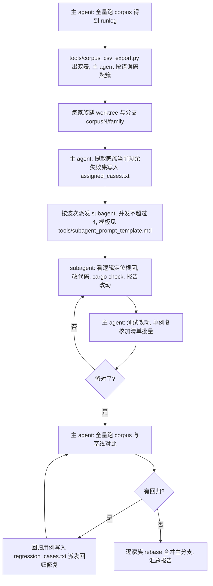

> 版本：v1.2 · 2026-09-20

# corpus 家族修复的多 subagent 工作流

主 agent 与 subagent 的分工编排：主 agent 负责定位、清单、验证与合并，subagent 负责清单内用例的修复。任务边界的决策与两个否决项的完整理由见 [decisions/subagent-corpus-repair.md](../decisions/subagent-corpus-repair.md)。

## 流程

## 分工

| 角色 | 职责 | 禁止 |
|---|---|---|
| 主 agent | 全量验证、失败聚类、清单生成、派发、单例复核、清单批量测试、回归裁决、合并、汇总 | 逐例修改代码 |
| subagent | 看逻辑定位根因、对照 Go 修代码、cargo check 编译通过、报告改动位置与逻辑依据、交接日志 | 一切批量测试、全量 corpus、全量 fourslash、清单外用例、merge 或 rebase、自行判读修改是否正确 |

修改是否正确的裁决在主 agent：subagent 允许跑单例复现失败形态用于定位（诊断用途），交付后由主 agent 测试，不通过打回重修。

## 派发 prompt 要素

- worktree 绝对路径与分支名，禁止触碰其他 worktree 与主仓
- assigned_cases.txt 为唯一工作清单，修完即止
- 长命令后台化与轮询纪律：预计超过 3 分钟的命令禁止阻塞等待
- 资源上限：构建 CARGO_BUILD_JOBS 封顶（按并发规模 2 到 4）、lib 测试 RUST_TEST_THREADS=1，全部包 ulimit -v 8388608
- 全量与批量测试必须 release 构建（cargo test --release）：release 相对 debug 有 5 倍执行提速，debug 跑全量时间不可接受。单例复现允许 debug
- 交付物：改动提交或补丁 + 改动位置与逻辑依据说明（哪个 Go 函数哪个语义点），测试结论一律留给主 agent
- 提交纪律：验证单元（5 到 20 例）家族批量净绿即提交，message 风格 fix(corpus): 家族 根因 手法，N 例转绿
- 交接日志 progress_notes.md 的读写约定
- 代码规范引用 AGENTS.md：禁解释性注释、300 行拆分、不新增内联测试

## 波次与资源

- 每波最多 4 个 subagent，波内家族按剩余失败数从大到小优先
- 并行负载合计不超过 24 核的 70%，避免内存带宽瓶颈；主 agent 的全量验证在波次间执行，不与波内并行叠加
- subagent 被配额终止时，从 progress_notes.md 与分支提交恢复现场，重新派发即可，已提交进度不丢失
